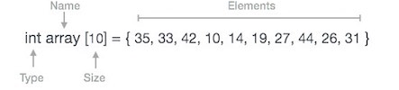
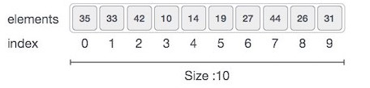
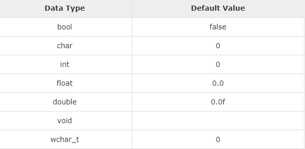
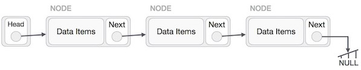
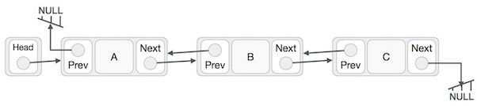
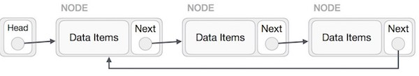
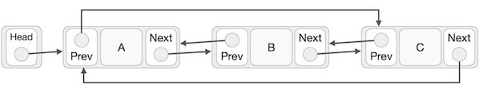
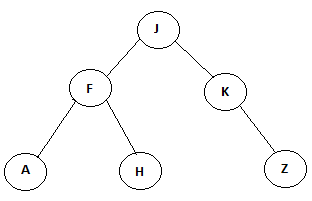

## [Orkhan ALIYEV](https://github.com/aliyevorkhan) arkadaşıma katkılarından dolayı teşekkür ederim.

## İçindekiler

1. [Veri Yapılarına Genel Bakış](#veri-yapılarına-genel-bakış)
1. [Veri Yapısının Özellikleri](#veri-yapısının-özellikleri)
1. [Veri Yapısı İhtiyacı](#veri-yapısı-ihtiyacı)
1. [Yürütme Süresi Kutuları](#yürütme-süresi-kutuları)
1. [Temel Terminoloji](#temel-terminoloji)
1. [Veri Yapıları Temelleri](#veri-yapıları-temelleri)
    1. [Veri Tanımı](#veri-tanımı)
    1. [Veri Nesnesi](#veri-nesnesi)
    1. [Veri Tipi](#veri-tipi)
        1. [Dahili Veri Tipi](#dahili-veri-tipi)
        1. [Türetilmiş Veri Tipi](#türetilmiş-veri-tipi)
1. [Diziler](#diziler)
    1. [Dizilerde Temel İşlemler](#dizilerde-temel-işlemler)
        1. [Ekleme İşlemi](#ekleme-işlemi)
        1. [Silme İşlemi](#silme-işlemi)
        1. [Arama İşlemi](#arama-işlemi)
        1. [Güncelleme İşlemi](#güncelleme-işlemi)
1. [Listeler](#listeler)
    1. [Bağlı Liste(Linked List)](#bağlı-liste)
        1. [Bağlı Liste Türleri](#bağlı-liste-türleri)
            * [Tek Yönlü Bağlı Liste(Singly Linked List)](#tek-yönlü-bağlı-liste)
            * [Çift Yönlü Bağlı Liste(Doubly Linked List)](#çift-yönlü-bağlı-liste)
            * [Dairesel Bağlı Liste(Circular Linked List)](#dairesel-bağlı-liste)
1. [Trees(Ağaçlar)](#trees)
    1. [Binary Trees(İkili Ağaçlar)](#binary-trees)
        1. [Properties of Binary Trees(İkili Ağaçların Özellikleri)](#properties-of-binary-trees)
1. [Kaynakça](#kaynakça)

## Veri Yapılarına Genel Bakış

Veri Yapısı, verileri verimli kullanmak için verileri organize etmenin sistematik bir yoludur. Aşağıdaki terimler bir
veri yapısının temel terimleridir.
<ul>
    <li>
        <b>Arayüz</b> - Her veri yapısının bir arayüzü vardır. Arayüz bir veri yapısının desteklediği işlem kümesini
        temsil
        eder. Bir arabirim yalnızca desteklenen işlemlerin listesini, kabul edebilecekleri parametre türlerini ve bu
        işlemlerin
        türünü döndürür.
    </li>
    <li><b>Uygulama</b> - Uygulama, bir veri yapısının iç temsilini sağlar. Uygulama ayrıca, veri yapısının
        işlemlerinde
        kullanılan algoritmaların tanımını sağlar.
    </li>
</ul>

## Veri Yapısının Özellikleri

<ul>
    <li>
        <b>Doğruluk</b> - Veri Yapısı uygulaması, arayüzünü doğru şekilde uygulamalıdır.
    </li>
    <li>
        <b>Zaman Karmaşıklığı</b> - Veri yapısı işlemlerinin çalışma süresi veya yürütme süresi mümkün olduğu kadar
        küçük
        olmalıdır.
    </li>
    <li>
        <b>Karmaşıklığı</b> - Bir veri yapısı işleminde bellek kullanımı mümkün olduğunca az olmalıdır.
    </li>
</ul>

## Veri Yapısı İhtiyacı

Uygulamalar karmaşıklaştıkça ve veri bakımından zenginleştikçe, uygulamaların bugünlerde karşılaştığı üç genel
sorun var.
<ul>
    <li>
        <b>Veri Arama</b> - Bir mağazanın 1 milyon (10^6) kaleminden oluşan bir envanteri düşünün. Eğer uygulamanın
        amacı
        bir öğeyi
        aramaksa.
        Aramayı yavaşlatan sebep her seferinde 1 milyon (10^6) maddede arama yapması gerekmesidir. Veriler büyüdükçe
        arama
        yavaşlar.
    </li>
    <li>
        <b>İşlemci hızı</b> - İşlemci hızı çok yüksek olabilir fakat, veriler milyarca olduğu takdirde bu işlemci hızı
        bir
        işe
        yaramaz.
    </li>
    <li>
        <b>Birden çok istek</b> - Binlerce kullanıcı bir web sunucusunda aynı anda veri arayabildiğinden, veri ararken
        çok
        hızlı
        sunucu bile başarısız olur.
    </li>
    Veri yapıları yukarıdaki problemleri çözmek için bize yardımcı olur. Veriler, veri yapısında tüm öğelerin aranması
    gerekmeyebilecek ve gerekli veriler neredeyse anında aranabilecek şekilde düzenlenebilir.

</ul>

## Yürütme Süresi Kutuları

Çeşitli veri yapısının yürütme süresini göreceli bir şekilde karşılaştırmak için kullanılan üç durum vardır.
<ul>
    <li>
        <b>En Kötü Durum</b> - Bu, belirli bir veri yapısı işleminin alabileceği maksimum süreyi aldığı senaryodur. Bir
        işlemin
        en
        kötü durum süresi ƒ (n) ise, bu işlem ƒ (n) 'in n işlevini temsil ettiği ƒ (n) zamandan daha uzun sürmez.
    </li>
    <li>
        <b>Ortalama Durum</b> - Bu, bir veri yapısının işleminin ortalama yürütme zamanını gösteren senaryodur. Bir
        işlem
        yürütme
        sırasında ƒ (n) zaman alırsa, m işlemleri mƒ (n) zaman alır.
    </li>
    <li>
        <b>En İyi Durum</b> - Bu, bir veri yapısının çalışmasının mümkün olan en az yürütme süresini gösteren
        senaryodur.
        Bir
        işlem
        yürütmede ƒ (n) zaman alırsa, gerçek işlem ƒ (n) kadar maksimum olan rasgele sayı olarak zaman alabilir.
    </li>
</ul>

## Temel Terminoloji

<ul>
    <li>
        <b>Veri</b> - Veri değer veya değer kümesidir.
    </li>
    <li>
        <b>Veri Öğesi</b> - Veri öğesi, tek bir değer birimini ifade eder.
    </li>
    <li>
        <b>Grup Öğeleri</b> - Alt öğelere ayrılan veri öğesine Grup Öğeleri denir.
    </li>
    <li>
        <b>Temel Öğeler</b> - Bölünemeyen veri öğesi, Temel Öğeler olarak adlandırılır.
    </li>
    <li>
        <b>Nitelik ve Varlık</b> - Varlık, değer atanabilecek belirli nitelikleri veya özellikleri içeren varlıktır.
    </li>
    <li>
        <b>Varlık Kümesi</b> - Benzer özellikteki varlıklar, bir varlık kümesini oluşturur.
    </li>
    <li>
        <b>Alan</b> - Alan, bir işletmenin bir niteliğini temsil eden tek bir temel bilgi birimidir.
    </li>
    <li>
        <b>Kayıt</b> - Kayıt, belirli bir varlığın alan değerlerinin toplamıdır.
    </li>
    <li>
        <b>Dosya</b> - Dosya, belirli bir varlık kümesindeki varlıkların kayıtlarının toplamıdır.
    </li>
</ul>

## Veri Yapıları Temelleri

Veri Yapısı, verileri verimli kullanılabilecek şekilde organize etmenin bir yoludur. Bu döküman veri yapısı ile ilgili
temel terimleri açıklamaktadır.

### Veri Tanımı

Veri Tanımı, aşağıdaki özelliklere sahip belirli bir veriyi tanımlar.
<ul>
    <li>
        <b>Atomik</b> - Tanım tek bir kavram tanımlamalıdır
    </li>
    <li>
        <b>İzlenebilir</b> - Tanım, bazı veri öğelerine eşlenebilmelidir.
    </li>
    <li>
        <b>Düzgün</b> - Tanım net olmalıdır.
    </li>
    <li>
        <b>Açık ve Özlü</b> - Tanım anlaşılabilir olmalıdır.
    </li>
</ul>

### Veri Nesnesi

Veri Nesnesi, verileri olan bir nesneyi temsil eder.

### Veri tipi

Veri türü, karşılık gelen veri türüyle kullanılabilecek değerleri, karşılık gelen veri türünde gerçekleştirilebilecek
işlem türlerini belirleyen tam sayı, dizge vb. gibi çeşitli veri türlerini sınıflandırma yoludur. İki tip veri türü -
<ul>
    <li>
        <b>Dahili Veri Tipi</b>
    </li>
    <li>
        <b>Türetilmiş Veri Türü</b>
    </li>
</ul>

### Dahili Veri Tipi

Bir dilin yerleşik desteğine sahip olduğu veri türleri, Dahili Veri türleri olarak bilinir. Örneğin, dillerin çoğu
yerleşik veri türlerini takip etmeyi sağlar.
<ul>
    <li>
        <b>Tamsayılar</b>
    </li>
    <li>
        <b>Boole (doğru, yanlış)</b>
    </li>
    <li>
        <b>Yüzer (Ondalık sayılar)</b>
    </li>
    <li>
        <b>Karakter ve Dizeler</b>
    </li>
</ul>

### Türetilmiş Veri Tipi

Birinden veya başka bir şekilde uygulanabileceğinden uygulamadan bağımsız olan veri tipleri, türetilmiş veri türleri
olarak bilinir. Bu veri tipleri normalde birincil veya dahili veri tiplerinin ve bunlarla ilişkili işlemlerin
birleşimiyle oluşturulur. Örneğin -
<ul>
    <li>
        <b>Liste</b>
    </li>
    <li>
        <b>Dizi</b>
    </li>
    <li>
        <b>Yığın</b>
    </li>
    <li>
        <b>Kuyruk</b>
    </li>
</ul>
<h3>
    Temel işlemler
</h3>
Veri yapılarındaki veriler belirli işlemlerle işlenir. Seçilen belirli veri yapısı büyük ölçüde veri yapısı üzerinde
yapılması gereken işlemin sıklığına bağlıdır.
<ul>
    <li>
        <b>Traversing(Çaprazlama ilerleme)</b>
    </li>
    <li>
        <b>Searching(Arama)</b>
    </li>
    <li>
        <b>Insertion(Ekleme)</b>
    </li>
    <li>
        <b>Deletion(Silme)</b>
    </li>
    <li>
        <b>Sorting(Sıralama)</b>
    </li>
    <li>
        <b>Merging(Birleştirme)</b>
    </li>
</ul>

## Diziler

Dizi, sabit sayıda öğeyi tutabilen bir kaptır ve bu öğeler aynı türden olmalıdır. Veri yapısının çoğu, algoritmalarını
uygulamak için dizi kullanır. Array kavramlarını anlamak için önemli terimler aşağıdadır.
<ul>
    <li>
        <b>Öğe</b> - Dizide depolanan her öğeye öğe adı verilir.
    </li>
    <li>
        <b>Dizin</b> - Bir dizideki bir öğenin her konumu, öğeyi tanımlamak için kullanılan sayısal bir dizine
        sahiptir.
    </li>
</ul>

## Dizi Temsili

Diziler, farklı dillerde çeşitli şekillerde açıklanabilir. Örnek olarak, C dizi tanımını ele alalım.

Yukarıdaki resmlere göre, dikkate alınması gereken önemli noktalar aşağıdadır.
<ul>
    <li>
        Diziler 0 ile başlar.
    </li>
    <li>
        Dizi uzunluğu 10'dur, yani 10 öğe saklayabilir.
    </li>
    <li>
        Her elemana indeksi üzerinden erişilebilir.
    </li>
</ul>

## Dizilerde Temel işlemler

Bir dizi tarafından desteklenen temel işlemler aşağıdadır.
<ul>
    <li>
        <b>Traverseing(Çaprazlama ilerleme)</b> - tüm dizi öğelerini tek tek yazdırın.
    </li>
    <li>
        <b>Insertion(Ekleme)</b> - Verilen dizine bir öğe ekler.
    </li>
    <li>
        <b>Deletion(Silme)</b> - Belirtilen dizindeki bir öğeyi siler.
    </li>
    <li>
        <b>Searching(Arama)</b> - Verilen dizini kullanarak veya değeri kullanarak bir öğeyi arar.
    </li>
    <li>
        <b>Update(Güncelle)</b> - Verilen dizindeki bir öğeyi günceller.
    </li>
</ul>
C'de, bir dizinin boyutu ile başlatıldığında, öğelerine varsayılan değerleri aşağıdaki sırayla atar.

### Ekleme işlemi
Ekleme işlemi, bir diziye bir veya daha fazla veri öğesi eklemektir. Gereksinime bağlı olarak, başında, sonunda veya
herhangi bir dizi içerisinde yeni bir öğe eklenebilir.

### Silme İşlemi
Silme, var olan bir öğeyi diziden kaldırmayı ve dizinin tüm öğelerini yeniden düzenlemeyi ifade eder.

### Arama İşlemi
Bir dizi öğesini, değerini veya indisini temel alarak arama yapabilirsiniz.

### Güncelleme İşlemi
Güncelleme işlemi, belirli bir indiste varolan bir öğenin güncellenmesi anlamına gelir.

## Listeler

## Bağlı Liste

Bağlı bir liste, bağlantılar yoluyla birbirine bağlanmış bir dizi veri yapısıdır.

Bağlı Liste, öğeleri içeren bir bağlantılar dizisidir. Her bağlantı başka bir bağlantıya bağlantı içerir. Bağlı
liste, diziden sonraki en çok kullanılan veri yapısıdır. Bağlı Liste kavramını anlamak için önemli terimler
aşağıdadır.
<ul>
    <li>
        <b>Bağlantı</b> - Bağlı listedeki her bağlantı, öğe olarak adlandırılan verileri saklayabilir.
    </li>
    <li>
        <b>Sonraki</b> - Bağlı listedeki her bağlantıda İleri adlı bir sonraki bağlantıya bir bağlantı bulunur.
    </li>
    <li>
        <b>LinkedList</b> - Linked List, First adındaki ilk linke bağlantıyı içerir.
    </li>
</ul>

<h3>Bağlı Liste Temsili</h3>

Bağlı liste, her düğümün bir sonraki düğüme işaret ettiği bir düğüm zinciri olarak örneklendirilebilir.

Yukarıdaki resme göre, dikkate alınması gereken önemli noktalar aşağıdadır.
<ul>
    <li>
        Bağlı Liste, önce adı verilen bir bağlantı elemanı içerir.
    </li>
    <li>
        Her bağlantı bir veri alanı ve bir sonraki adı verilen bir bağlantı alanı taşır.
    </li>
    <li>
        Her link bir sonraki linkini kullanarak bir sonraki linke bağlanır.
    </li>
    <li>
        Son bağlantı, listenin sonunu işaretlemek için boş bir bağlantı taşır.
    </li>
</ul>

### Bağlı Liste Türleri

Çeşitli Bağlı liste türleri aşağıdadır.
<ul>
    <li>
        <b>Tek Yönlü Bağlı Liste</b> - Öğe gezinme sadece ileri.
    </li>
    <li>
        <b>Çift Yönlü Bağlı Liste</b> - Öğeler ileri ve geri götürebilir.
    </li>
    <li>
        <b>Dairesel Bağlı Liste</b> - Son öğe, bir sonraki gibi ilk öğenin bağlantısını içerir ve ilk öğe, önceki
        gibi
        bir son
        öğenin bağlantısını içerir.
    </li>
</ul>

## Tek Yönlü Bağlı Liste

<h3>Temel işlemler</h3>

Bir liste tarafından desteklenen temel işlemler aşağıdadır.
<ul>
    <li>
        <b>Ekleme</b> - Listenin başına bir öğe ekler.
    </li>
    <li>
        <b>Silme</b> - Listenin başındaki bir öğeyi siler.
    </li>
    <li>
        <b>Görüntüleme</b> - Listenin tamamını görüntüler.
    <li>
        <b>Arama</b> - Verilen anahtarı kullanarak bir öğeyi arar.
    </li>
    <li>
        <b>Silme</b> - Verilen anahtarı kullanarak bir öğeyi siler.
    </li>
</ul>

## Çift Yönlü Bağlı Liste

Çift Yönlü Liste, Tek Yönlü Listeye göre kolayca ileri veya geri gezinmenin her iki yönde de mümkün olduğu
Yönlü listenin bir çeşididir. İkili Yönlü liste kavramını anlamak için önemli terimler aşağıdadır.
<ul>
    <li>
        <b>Bağlantı</b> - Yönlü listedeki her bağlantı, öğe olarak adlandırılan verileri saklayabilir.
    </li>
    <li>
        <b>Sonraki</b> - Yönlü listedeki her bağlantıda İleri adlı bir sonraki bağlantıya bir bağlantı bulunur.
    </li>
    <li>
        <b>Önceki</b> - Bağlanan listedeki her bağlantı, Önceki adlı önceki bağlantıya ait bir bağlantı içerir.
    </li>
    <li>
        <b>LinkedList</b> - Bağlı bir Liste, İlk adı verilen ilk bağlantıya ve Son adı verilen son bağlantıya bağlantı
        bağlantısını
        içerir.
    </li>
</ul>

<h3>Çift Yönlü Liste</h3>

Yukarıdaki resme göre, dikkate alınması gereken önemli noktalar aşağıdadır.
<ul>
    <li>
        Çift Bağlantılı Liste, ilk ve son olarak adlandırılan bir bağlantı öğesi içerir.
    </li>
    <li>
        Her bağlantı bir veri alanı ve sonraki ve prev olarak adlandırılan iki bağlantı alanı taşır.
    </li>
    <li>
        Her link bir sonraki linkini kullanarak bir sonraki linke bağlanır.
    </li>
    <li>
        Her bağlantı önceki bağlantıyı kullanarak önceki bağlantıyı kullanarak bağlanır.
    </li>
    <li>
        Son bağlantı, listenin sonunu işaretlemek için boş bir bağlantı taşır.
    </li>
</ul>

<h3>Temel işlemler</h3>
Bir liste tarafından desteklenen temel işlemler aşağıdadır.
<ul>
    <li>
        Ekleme - Listenin başına bir öğe ekler.
    </li>
    <li>
        Silme - Listenin başındaki bir öğeyi siler.
    </li>
    <li>
        Sonuncuyu Ekle - Listenin sonuna bir öğe ekler.
    </li>
    <li>
        Sonuncuyu Sil - Bir öğeyi listenin sonundan siler.
    </li>
    <li>
        Sonra Ekle - Listedeki bir öğenin arkasına bir öğe ekler.
    </li>
    <li>
        Sil - tuşunu kullanarak listeden bir öğe siler.
    </li>
    <li>
        İleri göster - Listenin tamamını ileri şekilde görüntüler.
    </li>
    <li>
        Geriye doğru göster - Listenin tamamını geriye doğru görüntüler.
    </li>
</ul>

## Dairesel Bağlı Liste

Dairesel Bağlı Liste, ilk öğenin son öğeye, son öğenin ilk öğeye işaret ettiği Bağlı listenin bir çeşididir.
Hem Tekli Bağlı Liste hem de İkili Bağlı Liste, dairesel bir Bağlı listeye eklenebilir.

<h3>Dairesel Olarak Tek Bağlı Liste</h3>
Tek başına bağlı listede, son düğümün bir sonraki göstericisi ilk düğüme işaret eder.

<h3>Dairesel Olarak İkili Bağlı Liste</h3>
İkili Bağlı listede, son düğümün bir sonraki göstericisi, ilk düğüme işaret eder ve ilk düğümün bir önceki
göstericisi, her iki yönde de dairesel yapan son düğüme işaret eder.

Yukarıdaki resme göre, dikkate alınması gereken önemli noktalar aşağıdadır.
<ul>
    <li>
        Son bağlantının sonraki listesi, hem tek tek hem de iki kat bağlantılı listedeki ilk listeye işaret eder.
    </li>
    <li>
        İkili bağlantı durumunda, ilk bağlantı önceki listenin sonunu gösterir.
    </li>
</ul>

<h3>Temel işlemler</h3>
Dairesel bir liste tarafından desteklenen önemli operasyonlar aşağıdadır.
<ul>
<li>
    insert - Listenin başına bir öğe ekler.
</li>
<li>
    delete - Bir öğeyi listenin başından siler.
</li>
<li>
    display - Listeyi görüntüler.
</li>
</ul>

## Trees

Ağaçlar; dizilerden, bağlı listelerden, doğrusal veri yapıları olan yığın ve kuyruklardan farklı olarak hiyerarşik veri yapılarıdır. En üstteki düğüme ağacın kökü denir. Bir düğümün altındaki düğümlere o düğümün çocukları denir. Bir düğümün üzerindeki düğüme o düğümün ebeveyni adı verilir. Aşağıdaki örnek için, "A", "F" nin çocuğu ve "F", "A" nın ebeveynidir. Çocuğu olmayan düğümlere ise yaprak adı verilir.

#### Neden Ağaçlar?

* Ağaçları doğal olarak hiyerarşi oluşturan bilgileri depolamak istediğimiz zaman kullanabiliriz. Örneğin, bir bilgisayarlardaki dosya sistemleri.
* Ağaçlar orta düzeyde erişim veya arama sağlar(Bağlı listelerden daha hızlı, dizilerden daha yavaş).
* Ağaçlar orta düzeyde ekleme veya silme sağlar(Dizilerden daha hızlı, sıralı olmayan bağlı listelerden daha yavaş).
* Bağlı listelerdeki gibi ama dizilerden farklı olarak, ağaçların düğümleri işaretçiler kullanılarak bağlandığı için, düğüm sayısında üst sınır yoktur.

### Binary Trees

Elemanlarının her birinin en fazla 2 çocuğa sahip olduğu ağaçlara ikili ağaç denir. İkili bir ağaçtaki her düğümün sadece 2 çocuğu olabileceğinden, genellikle bunları sol ve sağ çocuk olarak adlandırırız.

#### C Dilinde İkili Ağaç Gösterimi

Bir ağaç, ağaçtaki en üst düğüme işaretçi ile temsil edilir. Ağaç boşsa, kök değeri NULL olur.
Bir Ağaç düğümü aşağıdaki bölümleri içerir.
* Veri
* Sol çocuk için işaretçi
* Sağ çocuk için işaretçi

#### Properties of Binary Trees

<ul>
    <li>
        <b>Bir ikili ağacın 'k' seviyesindeki maksimum düğüm sayısı 2k-1'dir.</b> Burada seviye, kökten düğüme giden yoldaki düğüm sayısıdır (kök ve düğüm dahil). Kök seviyesi 1'dir. Örneğin; 
        Kök için(k = 1); Düğüm Sayısı = 2k - 1 = 1 olur.
    </li>
    <li>
        <b>H yüksekliğindeki bir ikili ağaçtaki maksimum toplam düğüm sayısı 2H - 1'dir.</b> Burada yükseklik, kökten yaprak yoluna kadar olan yüksekliktir. Tek düğümlü bir ağacın yüksekliği 1 olarak kabul edilir. Tüm seviyelerde maksimum düğüm varsa, o ağaçtaki maksimum düğüm sayısına ulaşılmıştır. Bu nedenle, H yüksekliğinde bir ikili ağaçtaki toplam maksimum düğüm sayısı 1 + 2 + 4 + .. + 2H-1'dir. Bu ise H terimli basit bir geometrik seridir ve bu serinin toplamı 2H - 1'dir.
    </li>
    <li>
        <b>N düğümlü bir ikili ağaç için mümkün olan minimum yükseklik veya minimum seviye sayısı Log2 (N + 1)dir.</b>
    </li>
    <li>
        <b>L sayıda yaprağı olan ikili ağaç var olabilir mi? Bunun için Log2L + 1 denkleminden faydalanırız.</b>
Bir ikili ağaç, tüm seviyeleri tamamen dolu iken maksimum yaprak sayısına (ve minimum seviye sayısına) sahiptir. Tüm yaprakların L seviyesinde olduğunu düşünerek aşağıdaki eşitliği inceleyelim: 
   L <= 2L-1 
   L = Log2L + 1  => eşitliği sağlanıyorsa L minimum seviye sayısıdır.
    </li>
    <li>
    <b>Her düğümün 0 veya 2 çocuğunun olduğu bir ikili ağaçta, yaprak düğüm sayısı her zaman iki çocuklu düğümlerin sayısından bir fazladır.</b> 
   L = Yaprak Düğüm Sayısı T = İki Çocuklu Düğüm Sayısı L = T + 1
    </li>
</ul>

## Kaynakça
<ul>
    <li> http://www.tutorialspoint.com/ </li> 
    <li> https://ocw.mit.edu/courses/electrical-engineering-and-computer-science/6-006-introduction-to-algorithms-spring-2008/lecture-notes/ </li>
    
</ul>
